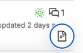
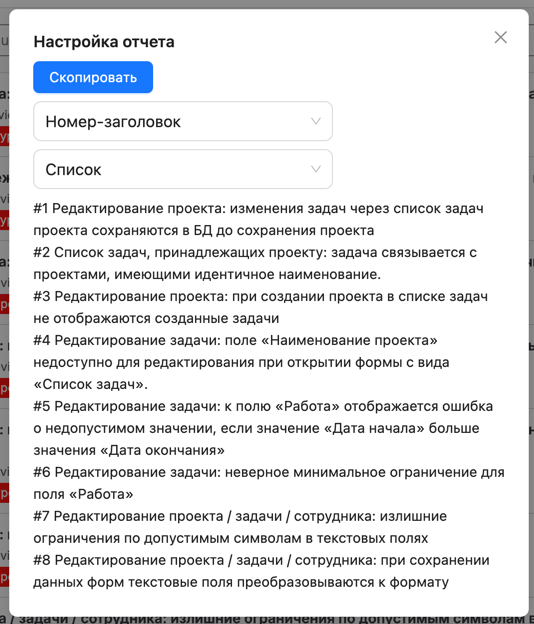
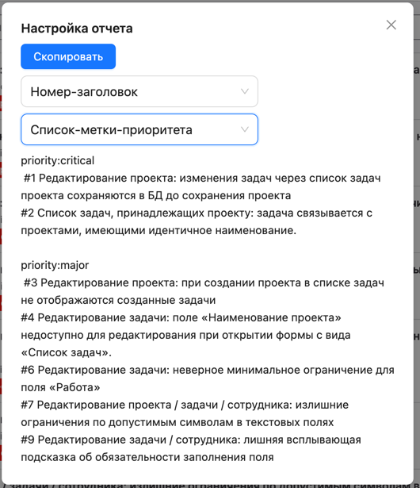

# Chrome plugin для получения информации из gitlab в буфер обмена.

## Причины создания

Копирование наименования и номера задачи из gitlab занимает достаточно времени.

## Основной функционал

- Парсинг отображаемых issue на странице.
- Настройки форматирования информации по задачам.
- Копирование информации в буфер обмена.

## Инструкция по установке

1) Склонировать данный репозиторий
2) Распаковать нужную версию в папке `release`
3) Открыть в chrome://extensions/
4) Включить developer mode 
5) Нажать на "Load unpacked" кнопку и выбрать распакованную версию плагина.

## Скриншоты

### Триггер открытия формы (правый нижний угол)

### Форма настройки отчета

## Кастомизация

Данный плагин поддерживает настройку через env.

После изменения значений, нужно заново собрать и подключить плагин.

Перед сборкой нужно либо увеличить версию в package.json, либо заранее удалить плагин из extensions в браузере.

### VITE_PLUGIN_MATCHES
Указывает, к каким страницам будет применяться плагин.

Формат значения: ссылка,ссылка

Текущее значение: https://git.qulix.com/*/*/-/issues/?*,https://git.qulix.com/*/*/-/issues

### VITE_PRIORITY_LABELS
Перечень label-ов для issue, по которым надо сгруппировать.

Формат значения: label, label

Текущее значение: priority:critical,priority:major,priority:minor,priority:trivial

Важно!
Название label строго должны совпадать с gitlab. 

## Зависимости

Node.js - 22.14.0
NPM - 10.9.2

## Доступные скрипты

### Установка зависимостей
``
npm install
``

### Сборка плагина
``
npm run build
``
После сборки сразу формируется архив в release папке.